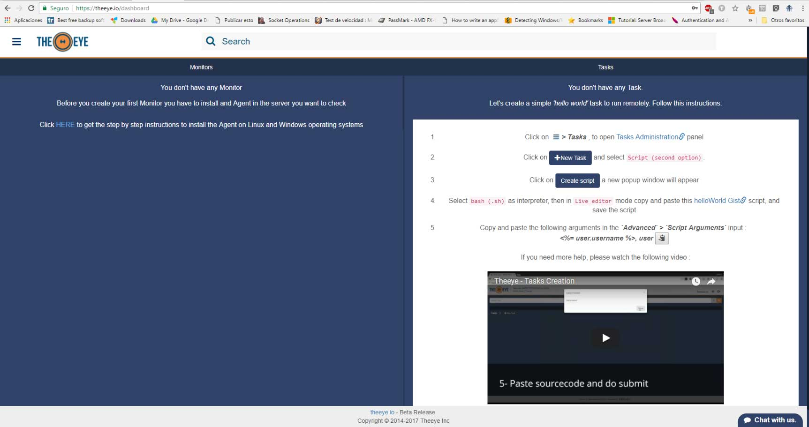

# Contents
#### [What is TheEye?](#what-is-theeye-1)
#### [First Steps](#first-steps-1)
  * ##### [Agent Installation](#agent-installation-1)
  * ##### [Check your first resource](#check-your-first-resource-1)

### [User Management](#users)
## [Resources](#resources-1)
#### [Monitors](#monitors-1)
#### [Tasks](#tasks-1)
#### [Webhooks](#webhooks-1)
#### [Provisioning](#provisioning-1)
#### [Organization](#organization-1)
#### [Scripts](#scripts-1)

+ [Writing Scripts](scripts/write.md)

+ [Scripts RunAs](scripts/runas.md)

+ [Samples](scripts)

+ [Integrations](integrations)

## Other Tools
+ [TheEye_Cli Util](https://github.com/theeye-io-team/theeye-docs/tree/master/cli)
+ [Build Agent Binary](https://github.com/theeye-io-team/theeye-docs/tree/master/agent/binary_build.md)
+ [Agent Docs](agent)
----

### What is TheEye
    * A remote server managament and a monitoring tool (Devops)
    * A server provisioning tool
    * A task manager (with scheduler)
    * A Workflow creation tool (IFTTT)
    * A technical repository
    * An integration platform
    * A Real time support tool
    
    
If you want start from the scratch, there's a native integration with ELK and Docker: 
[TheEye MindMap](https://atlas.mindmup.com/2017/11/5fa49fd0c43311e7b5da733708907222/theeye_functional_mindmap_es/index.html)

### First Steps
To start using ThEye you will need:
1. A user account. To get an user: https://theeye.io/register
2. Install an agent on each server you would like to perform actions.
3. Create yor first resource from TheEye Web.

Once you've activated your user account, you'll see this Dasboard after login:

#### Agent Installation
If it is the first time you access TheEye Website, click the link in the monitors panel where says "Click HERE to get the step by step instructions to install the Agent on Linux and Windows operating systems", otherwise go to "settings" in the left menu and get to the "installation" section. Installation instructions are provided for Linux and Windows systems.

+ Linux:

+ Windows:

#### Check your first resource
Check the Dashboard view after login, you should see "All up and running" in the monitors panel.

------------------------------

### Users
TheEye provides six different user roles. You can create users on the go with the appropiate role.
See the [Users Management Documentation](usertypes.md) for more details.

### Resources

#### Monitors
A monitor is used to check services' or resources' status. You can use this status information to take actions (e.g. run a task, send notification).
You can always customize the time between checks.

There're five kind of monitors you can set up from TheEye: Stats, Script, API/Web Check, Process and File.
Check the [Monitors Documentation](https://github.com/theeye-io/theeye-docs/blob/master/monitors.md) for more details.

#### Tasks

+ Script task. Linked to an event.

+ Create en endpoint API/WEB task.

+ Schedule a task.

You can use the task scheduler to create and manage tasks that TheEye will carry out automatically at the times you specify.
To view or perform an operation, go to the _Tasks_ section and click on the scheduler icon.

#### Scripts
Creación de script: 

#### Provisining (Templates)

Los templates, en este caso llamados "Provisoning", los usamos para asignar las tareas ya creadas en un host a un nuevo equipo.
Luego a la derencha donde tenemos las tasks, las vemos duplicadas pero porque apunta a diferentes servidores.

#### Webhooks
Un incoming webhook es una forma de acceder desde otro sistema, a su vez genera un link que al llamar la instrucción puede ejecutarla, si es que está vinculada a una tarea (o serie de tareas)

Las tareas se pueden ejecutar con trigger on y eso arma el Workflow.

# Workflow

Un Workflow nos sirve para ver como está la estructura de las tareas, cómo se realizan y cuál es su orden correlativo.
Por ej una tarea simple de un reinicio de servicio, el Workflow lo veremos de la siguiente manera:

En cambio un Workflow del tipo Webhook, lo veremos totalmente diferente:

