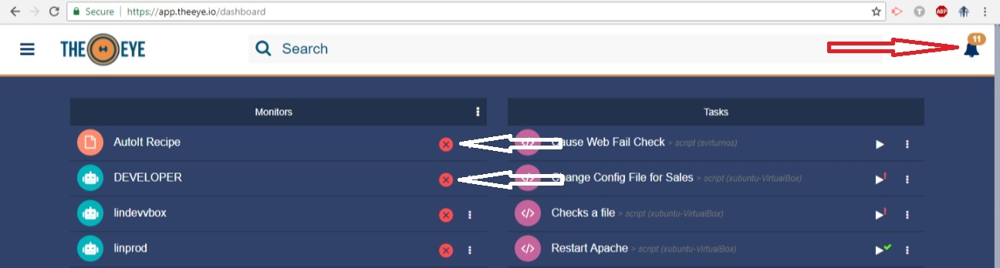
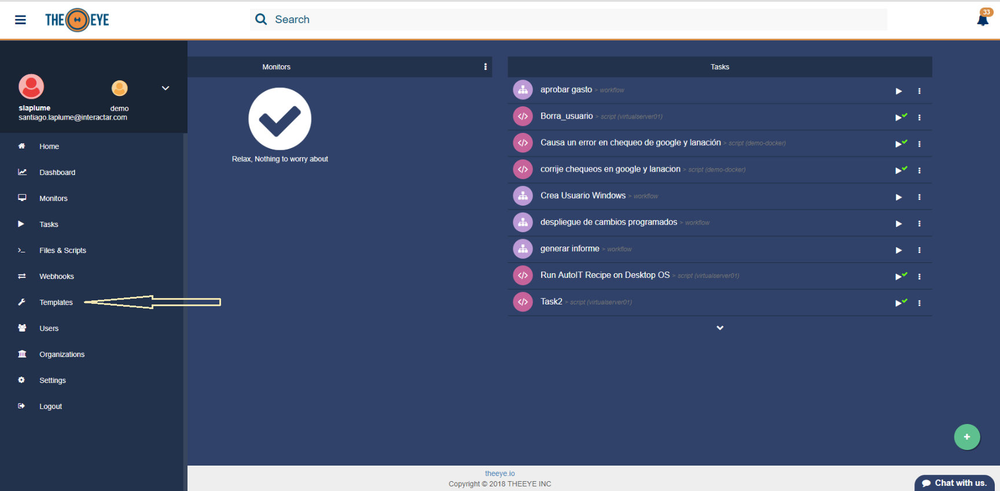

# Alerts and Notifications

### Alerts

Alerts are received every time an event occurs and are only visible from TheEye Dashboard on Web or on mobile. Alerts are only emmited for HIGH and CRITICAL resources. Every time you create a monitor you can configure whether it is a HIGH, CRITICAL or LOW resource.

### Notifications

Click on the Notification's Bell to see the events log. Events are retained for 3 days and you can always purge them all by clicking the trash icon.

The configuration ring in this panel will led you to the task Notification's settings where you can disable notifications for task events.

Click on "More Options" to completely disable Desktop and Mobile notifications.

### 

#### Mute Notifications for Monitors 

You can disable email notifications for Monitors by muting them from the dashboard as shown below:

