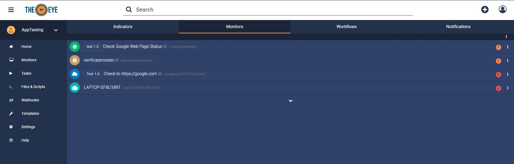

# Alerts and Notifications

### Alerts

Alerts are received every time an event occurs and are only visible from TheEye Dashboard on Web or on mobile. Alerts are only emmited for HIGH and CRITICAL resources. Every time you create a monitor you can configure whether it is a HIGH, CRITICAL or LOW resource. Alerts for CRITICAL resources are shown in red, for HIGH are shown in orange and for LOW are shown in yellow.

### Notifications

Alerts are also notified. Click on the Notification's Bell to see the events log. Events are retained for 3 days and you can always purge them all by clicking the trash icon.

The configuration ring in this panel will lead you to the task Notification's settings where you can disable notifications for task events.

Click on "More Options" to completely disable Desktop and Mobile notifications.

Desktop Notifications are received when you're logged in TheEye's WebApp.

Mobile Notifications \(Push Notifications\) are received once you've installed and logged in at least once to the mobile App.

#### Mute Notifications for Monitors 

You can disable email notifications for Monitors by muting them from the dashboard as shown below:

