# IAM Administration

Users's administration panel is only visible by a Full Priviledged User. Only available for enterprise implementations.

Drop down the arrow next to the Organization label to see the menu for:

- [x] Organizations   
- [ ] Members   
- [ ] Users   

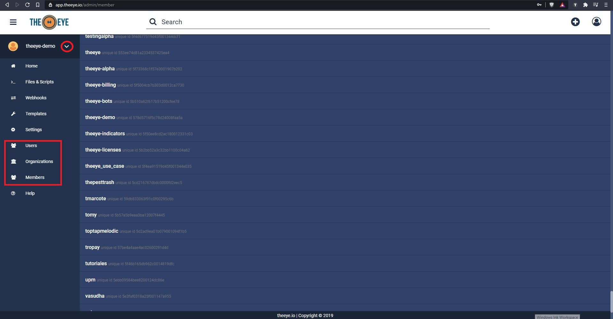

## **Organizations**

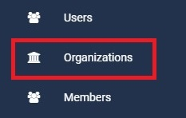

Create Organization for new Bots

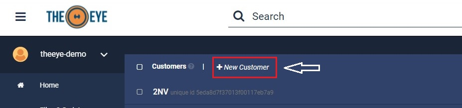

Fill in:

- **Name:** Organization name. Cannot be changed once created.
- **Display Name:** Organization name to show in the side panel. Can be changed after creation
- **Description:** Short text that describes de business unit.  
- [x] Kibana enabled
- [x] Elasticsearch enabled

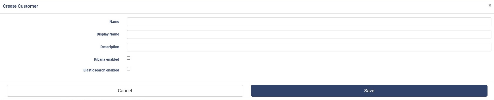

#### Check Members that belog to an Organization

> Search for the organizacion in the searchbar, click on the organization name in the results. You can edit/delete members directly bu clicking on the three spots next to the user.

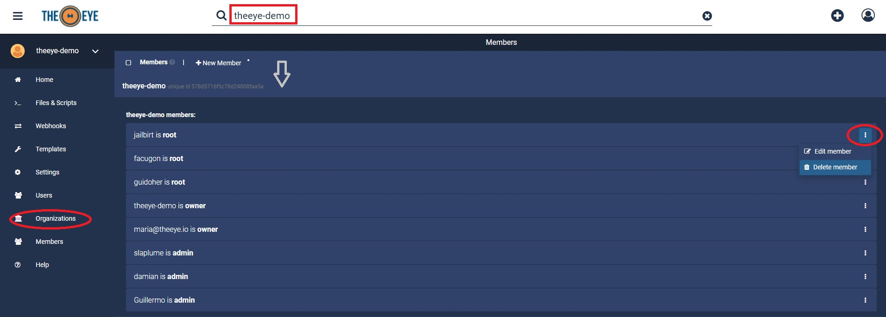

---

## **Members**

- [ ] Organizations
- [x] Members
- [ ] Users

### Active Directory Members

Assign a User to an Organization in order to grant access to TheEye from the Members' panel.
- > First of all make sure that the organization is already present.
- > Check that the user belongs to the corresponding Theeye Group in the Active Directory, usually "Theeye_users".

**Enable user for Login**

- [x] Enable user
- [ ] Set Credential
- [ ] Set an Organization

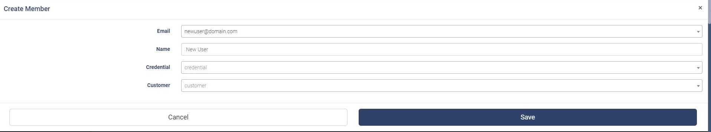

**Define the user Credential (user/admin/manager/owner)**

- [ ] Enable user
- [x] Set Credential
- [ ] Set an Organization

**Assign an Organization (where bots run)**

- [ ] Enable user
- [ ] Set Credential
- [x] Set an Organization

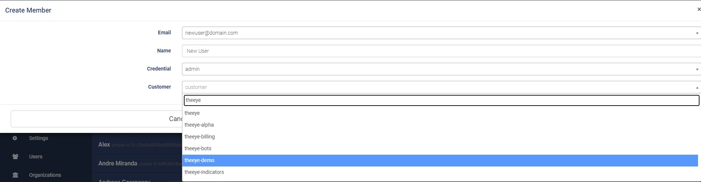

---

## **Users**

- [ ] Organizations
- [ ] Members
- [x] Users

From the user's screen you will be able to, create, modify and delete users.
The list is displayed by username.

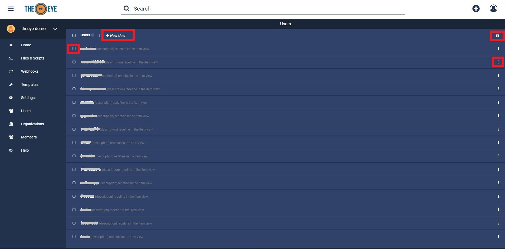

### Create Local User (e-mail is required)

Only available for local users' creation.
> Users that are member of an Active Directory Organizational Unit (OU) must not be created from this panel. All users that belong to an OU in Active Directory are automatically activated when invited from any of TheEye's Organizations.

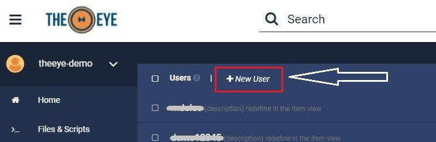

Fill in:

- Name: Full name
- Username: The username to enter at login screen
- Email: Valid email address
- [x] Enabled: When checked user will be automatically activaded for activation process by email is bypassed. A new password for the user the will be required.

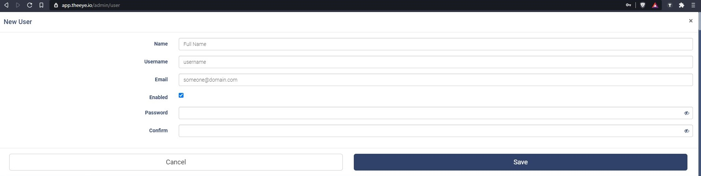

### Modify User
First of all search for the user by username or email.

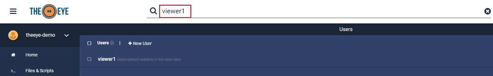

Click the three dots menu, next to the username you would like to modify. 

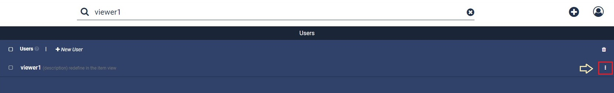

Click on edit/delete user:

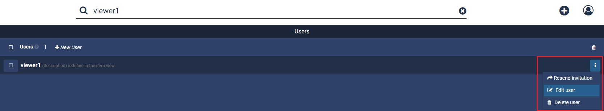
