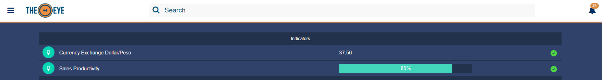

# Indicators

## Representation 

Indicators are shown at the top of the dashboard only when available.

#### Indicator kinds

* Text
  * The indicator value is shown as typed. value accepts strings
* Progress
  * The indicator value is shown in percent inside a bar, in the same way a progress bar does. value only accepts numbers
* Counter
  * A numeric value is shown starting at one. This indicator has special special methods to increase, decrease and restart the value. value accepts only valid numbers

#### Indicators' properties:

* **title:** The name that identifies the indicator
* **type:** Indicator kind \(valid indicator types are: progress/text/counter\)
* **state**: Normal or Failure. Status determines wether it is green\(normal\) or red\(failure\).
* **value**: The factor or quantity to show
* **read\_only**: true \| false. When set to false the indicator can be dismissed \(deleted\) from the Dashboard.
* **acl**: users that will be able to see the indicator. Expects an array with users: \["email1","email2", ...\]
* **severity:** high\| low. When set to HIGH the failure status will be shown in red, otherwise it will be shown in yellow.
* **description**: description field that is not visible in the Dashboard.

#### [Create an Indicator](#create)

Indicators can be created from dashboard from the "+"  button:

