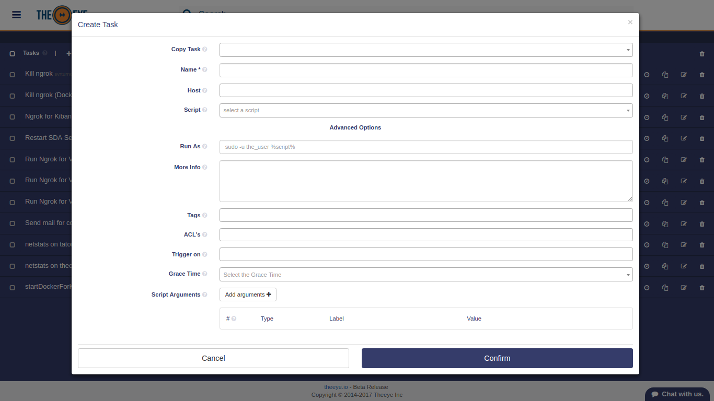

# Tasks

With TheEye we can create different types of Tasks.
A Task can also be considered as a template for a Job.

## Create and modify tasks

Creating a task is simple, from the dashboard, click in the "+" button to open the resources menu > click the "Task Button" (Play Icon) to create a new task.
Then select the task type you want to create. A task can be modified directly from the Dashboard.

You can also create, edit and delete tasks from the Tasks Admin page.

## Types of Task

### Script

Script Tasks requires a BOT to run. This task defines the set of orders and actions that the Bot must do. Actions are described as basic scripts.

Click on "advanced options" for further features. 

### Webhooks or HTTP Request

Check the [Webhooks](/core-concepts/webhooks/) for more details.

### Approval:

Approval tasks handle approval requests in workflows. As breakpoints do, an approval task will pause the workflow execution until it is approved or rejected. Many approvers can be selected, only one approval is needed to continue workflow actions.

### Input:

An input task is a special task commonly used to start workflows. When executed, the input parameters will be submitted directly to the next chained task in the workflow.

### Notification:

Check the [Task Notifications](/core-concepts/tasks/taskNotifications) for more details.

## Task Scheduler.

You can use the task scheduler to create and manage tasks that TheEye will carry out automatically at the times you specify. 
Task Scheduler can be created using natural language or cron expressions. The main difference between them is that cron expressions is executed always at the exact same date and time. On the other hand, natural language could produce some time shift on successive executions.

Schedules can be created from the Dasboard as shown here below

Your new schedule will be shown when the task row is expanded:

## Export and Import Tasks

Inside TheEye community you will hear that other people had already solved or automated typical common problems using the platform. When this automation was performed by a task, you will be able to import the solution or on the other hand export and share the tasks you have created.

To export a task recipe, go to the task, click on the context menu, and then click on the "export recipe" icon as shown here:

## Integration through API

Check the [Integration through API documentation](/api/) for more details.

## Executing Tasks

Tasks can be executed using different methods.

* UI Play Button
* Integration API Call
* Workflows
* Triggers
* Webhooks
