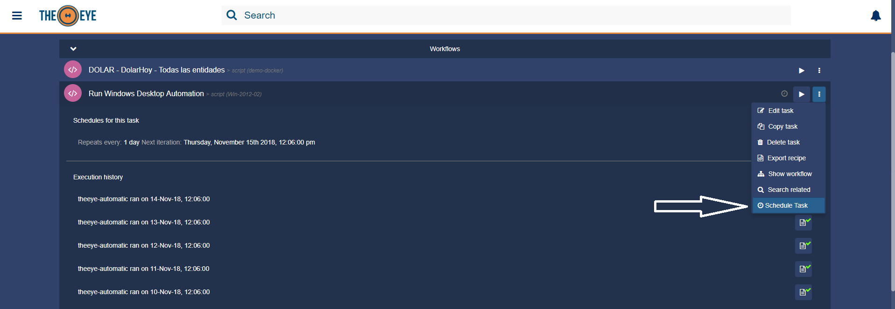

# Tasks

With TheEye we can create different types of Tasks.
A Task can also be considered as a template for a Job.

## Create and modify tasks

Creating a task is simple, from the dashboard, click in the "+" button to open the resources menu > click the "Task Button" (Play Icon) to create a new task.
Then select the task type you want to create. A task can be modified directly from the Dashboard.

You can also create, edit and delete tasks from the Tasks Admin page.

## Types of Task

### Script

Script Tasks requires a BOT to run. This task defines the set of orders and actions that the Bot must do. Actions are described as basic scripts.

Click on "advanced options" for further features. 

| UI Property | Api Property | Type | Description |
| ----- | ----- | ----- | ----- |
| Name | name | string | name your task |
| Bots | host_id | string | select the host where the script will run |
| Script | script_id | string | select the script to be executed by the task |
| Tags | tags | strings array | tag your task so you can find quickly through the application. |
| Task Arguments | task_arguments | array | If the script played by the task is meant to receive parameters you can set them from here. Mind the order as it will be used by the script. _Fixed_, _options_, and _input_ arguments are allowed. _Input_ and _options_ arguments will be asked to the user for execution. _Fixed_ arguments will not be displayed to the user at execution time. |
| Copy Task |  |  | select an already created task as template |
| Run As | run_as | string | write down any extra command or argument needed to run the script. Windows users must declare here which interpreter to use. Linux users could prepend sudo |
| Description | description | text | describe your task. What does it do, what's the expected output after execution |
| ACL's | acls | array | select who can view your task \(what can be done with the task depends on the user role\) |
| Triggered by | triggers | array | If the task is part of a workflow, select what triggers the task. The task will be triggered by the resource you selected here. |
| Trigger on-hold time | grace_time | number | enter the time period TheEye should wait before running the task. _No wait / Cancelation_ can be selected which means the task will run inmediately after triggered. \(only applicable for triggered tasks\). **To cancel the task execution during the grace period, go to tasks panel, expand the task and delete the schedule created by the trigger.** |
| Execution Timeout | timeout | number | This is the number of seconds the Bot will wait for the script to complete the execution. If the timeout is exceeded the Bot will try to terminate(kill) the script, sending SIGTERM/SIGKILL signal |
| Multitasking | multitasking | boolean | enable or disable parallel execution of the task. When this is enable assigned bot will be able to run multiple instances of the Job at same time. this is important to check when running DesktopBots |
| Environment (env) | env | string | Define extra environment variables that will be present during script execution |

### Webhooks or HTTP Request

Check the [Webhooks](/core-concepts/webhooks/) for more details.

### Approval:

Approval tasks handle approval requests in workflows. As breakpoints do, an approval task will pause the workflow execution until it is approved or rejected. Many approvers can be selected, only one approval is needed to continue workflow actions.

### Input:

An input task is a special task commonly used to start workflows. When executed, the input parameters will be submitted directly to the next chained task in the workflow.

### Notification:

Check the [Task Notifications](/core-concepts/tasks/taskNotifications) for more details.

## Task Arguments.

To received input values into tasks it is required to define the Task Arguments.
It is important to define the arguments in the same order in which they will be used in the script.

| Type | UI Usage | Workflow Usage |
| ----- | ----- | ----- |
| Fixed | will not be visible to users into forms | this is a fixed value that will be always the same. cannot be rewrited or replaced |
| Text | a free text input | it is usefull to receive dynamic values from outputs to inputs |
| Options | create an options element | behave as Text Argument |
| Remote Options | create an options element using the response of a Remote API. It is posible to include the email of the user executing the task at the momento of the fetch. This will be achived including the keyword %THEEYE_USER_EMAIL% in the queystring of the url of remote api. Example url http://tracking-tool.domain.com/tickets?user=%THEEYE_USER_EMAIL% | behave as Text Argument |
| Date | create a Date Picker element | behave as Text Argument |
| Email | creates a text input that only accepts email strings | behaves as Text Argument |
| File | create a File Selection element | when it is used with Script Tasks the uploaded file will be downloaded and the argument will contain the local path to the file. |
| RegExp | creates a text input that only accepts regular expression and validate the format | behave as Text Argument |

## Task Scheduler.

You can use the task scheduler to create and manage tasks that TheEye will carry out automatically at the times you specify. 
Task Scheduler can be created using natural language or cron expressions. The main difference between them is that cron expressions is executed always at the exact same date and time. On the other hand, natural language could produce some time shift on successive executions.

Schedules can be created from the Dasboard as shown here below

Your new schedule will be shown when the task row is expanded:

## Export and Import Tasks

Inside TheEye community you will hear that other people had already solved or automated typical common problems using the platform. When this automation was performed by a task, you will be able to import the solution or on the other hand export and share the tasks you have created.

To export a task recipe, go to the task, click on the context menu, and then click on the "export recipe" icon as shown here:

## Integration through API

Check the [Integration through API documentation](/api/) for more details.

## Executing Tasks

Tasks can be executed using different methods.

* UI Play Button
* Integration API Call
* Workflows
* Triggers
* Webhooks
