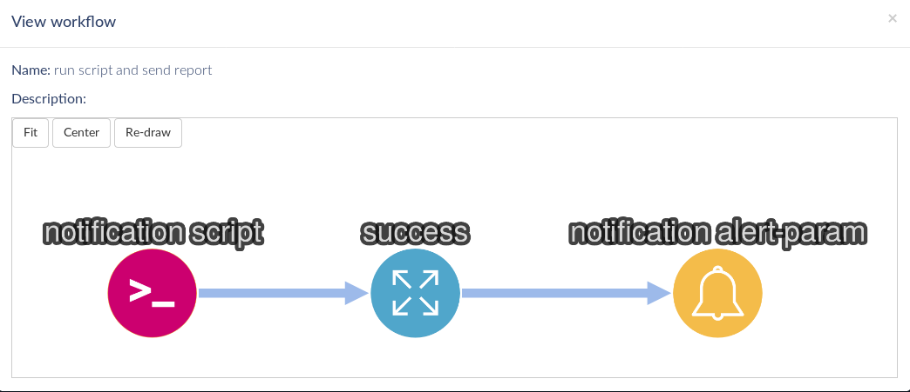

# TheEye Notifications :

## How to work with task and notifications.

The toolkit allows you to streamline the flow of notifications and trigger them.

The notifications can have different origins:

- A task by script, you can send your output parameters, as an input in a notification task.

- A task by input, allows an operator to load the parameters of the msg that will receive the notification task.

- A notification can be part of workflows

- Workflows allows to send customized notifications with dynamicazlly generated content. 

* If you need assistance, contact us *

### Notification Task details.

*This type of task is responsible for sending messages inside and outside theeye*

| UI Property | API Property | Type        | Description |
| ---         | ---          | ---         | --- |
| Name        | name         | text        | an identification name for the task |
| Subject     | subject      | text        | subject to include in all the of notifications |
| Email Body  | body         | text, html formatted allowed | this field is used if the *send email* is checked (true). else is ignored |
| Tags        | tags         | text array  | list of tags. this is usefull to filte and search in theeye app |
| Description | description  | text        | a description. this is added in workflows documentation and in the app ui |
| Triggers    | triggers     | Event array | chain tasks events to create workflows |
| ACL's       | acl          | text array  | list of users email. should be valid and registered in theeeye | 
| Send Email notification | notificationTypes.email | boolean | whether or not to send notification via email |
| Send Desktop notification (theeye desktop app) | notificationTypes.desktop | boolean | whether or not to create an internal notification to theeye app desktop and mobile. If checked (true), this will create a new Notification in the App Notifications panel |
| Send Push notification (mobile) | notificationTypes.push | boolean | whether or not to send mobile notification |

*Example:* 
You can download the following sample recipe right now to integrate into your workflow
[Task type: notification](../../assets/recipes/task_type-notification-send_notification.json)

#### Types of tasks: Input

*This type of task is responsible for request parameters from an operator.*

Check the [Task input](/core-concepts/tasks/) for more details.

*Example:* 
You can download the following sample recipe right now to integrate into your workflow
[Task type: Input](../../assets/recipes/task_type-input-send_notification.json)

#### Types of tasks: Scripts

*This type of task is responsible for execute processes and functions, and finally deliver reports. The format of the output parameters allows the integration with the task type notification.*

Check the [Task scripts](/core-concepts/tasks/) for more details.

*Example:* 
You can download the following sample recipe right now to integrate into your workflow
[Task type: Scripts](../../assets/recipes/task_type-script-send_notification.json)

### Sample tasks for sending notifications

**Create a workflow**

- task A: notification script
    - [Task type: Scripts](../../assets/recipes/task_type-script-send_notification.json)
- state: success
- Task B: task notification
    - [Task type: notification](../../assets/recipes/task_type-notification-send_notification.json)

**Run a workflow**

