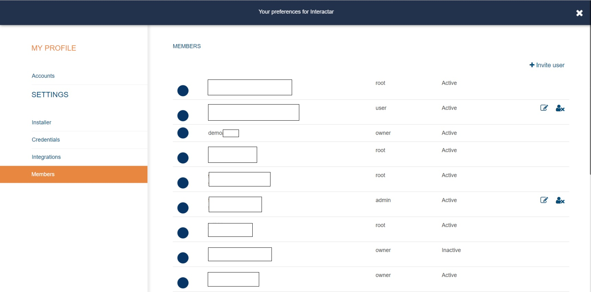

# User Management

## Roles

1. **owner**
    * full access
    * full control of organizations
    * create and modify
    * tasks execution
    * acls administration
    * members control

2. **admin**
    * full access
    * create and modify
    * tasks execution
    * acls administration

3. **manager**
    * members control
    * view (ACL's required)
    * tasks execution (ACL's required)
      
4. **user**
    * view (ACL's required)
    * tasks execution (ACL's required)

5. **viewer**
    * view (ACL's required)

## Members control

To Create, modify or delete users, go to _Settings_ from the left menu and then go to _Members_ section.

When you invite a new user, you will be prompted to select the user's role \(admin/user/viewer/manager\). The role can be changed at any time by a user manager. The user account must be activated by the activation link sent by email.

## ACLs

In the previous section we've described user roles and user administration. ACLs applies directly to resources. Admin roles can make resources visible to other members by adding them to the input field labeled _ACL's_ available on _Tasks_ and _Monitors_. When a user is added to an ACL list, then the resource becomes available and accesible according to the member's role. Notifications are sent to all users within the ACL list, regardless the user role. E-mail addresses can also be added to ACLs lists in order to have them notified disregarding any account membership.

