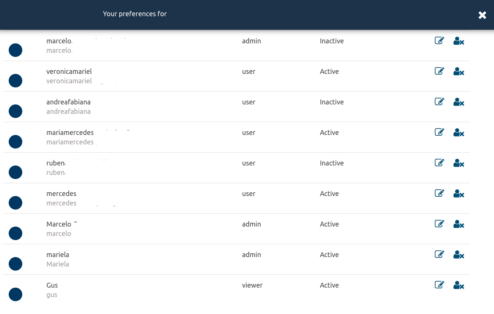
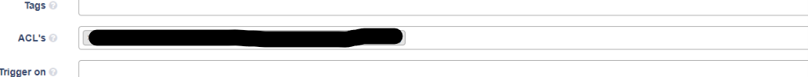

# User Management

## Roles

1. **owner**
    * full access
    * full control of organizations
    * create and modify
    * tasks execution
    * acls administration
    * members control

2. **admin**
    * full access
    * create and modify
    * tasks execution
    * acls administration

3. **manager**
    * members control
    * view (ACL's required)
    * tasks execution (ACL's required)
      
4. **user**
    * view (ACL's required)
    * tasks execution (ACL's required)

5. **viewer**
    * view (ACL's required)

## Members control

To add, modify or revoke users for the current organization, go to the left hamburguer menu , then go to _Settings_ > _Members_ section.

When you invite a new member, it will be prompted to select the user's role \(admin/user/viewer/manager\).
The role can be changed at any time by a manager or the owner of the account.

## ACLs

In the previous section we've described user roles and user administration.
ACLs applies directly to resources.
Admin users can make resources visible to other members by adding them to the input field labeled _ACL's_ available on _Tasks_ and _Monitors_.
When a user is added to an ACL list, then the resource becomes available and accesible according to the member's role.
Notifications are sent to all users within the ACL list, regardless the user role.

## Users Domain Controller

On-premise installations allows to integrate the core authorization and user access control to a Domain Controller.

Once the integration is configured, the system will authenticate every user by default throught the Domain Controller.
Follow this steps to register users

1. Into the Domain Controller, search the user profile and add the desired group.
To correctly register a user it must be assigned to a recognized Group by theeye.
One of the following groups must be used

  * theeye_owner     
  * theeye_admins     
  * theeye_managers    
  * theeye_users   
  * theeye_viewers or none to assign to viewers group

2. Login into TheEye to complete the registration.

3. After successful registration the user can be invited to any organization by the Owner.

By default all new users will be assigned to a default on-premise organization. This is a core integration setting.
