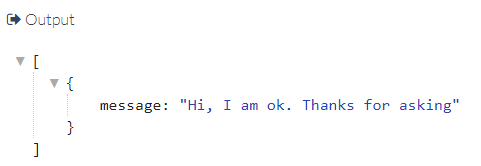
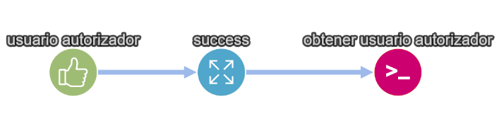

# TheEye FAQ

[](https://theeye.io/en/index.html)

This page provides help with the most common questions about TheEye.

You can also search all TheEye's help pages using the search box to the right, or browse the Nav menu or the Help directory.

# FAQs from ours users about:

## Obtener usuario aprobador en TheEye

### Curl en TheEye

  Crear una tarea con un script tipo bash y dentro script colocar el siguiente comando:
  curl HOSTNAME:PORT/status

[]

### HTTP request con nodejs

  Crear una tarea con un script 
  Utilizar http para hacer request a la URL 

#### ACCESS_TOKEN : Dirigirse a la seccion de Setting (Configuracion) -> Credentials (Credenciales)

Las opciones (parametros) para el request son:
 
```json
{
  "hostname": "HOSTNAME",
  "port": "PORT",
  "path": "/status",
  "method": "GET"
}
```
[] 

### Obtener usuario Aprobador

  1. Crear workflow que incluya una tarea tipo approval 

[]

  2. Crear tarea node para hacer request 

*Consult with the support team, for a recipe and updated script.*


