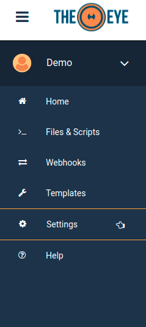
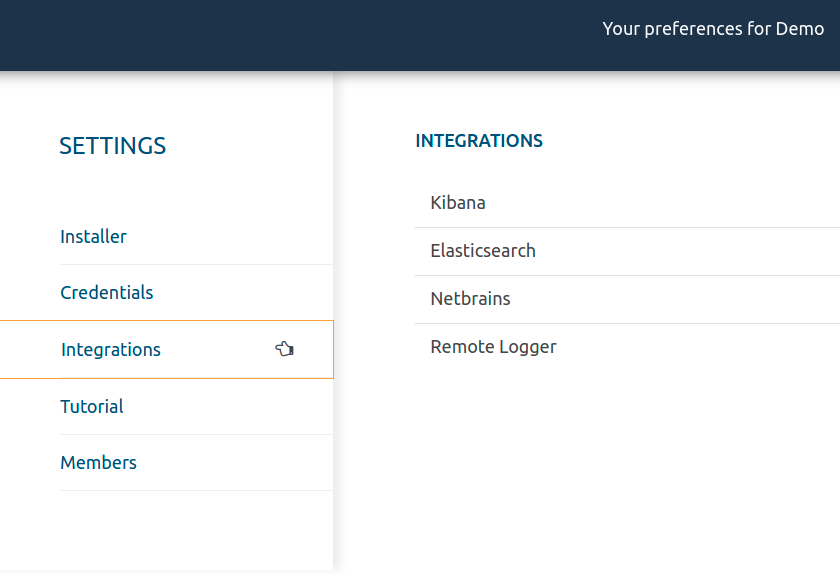
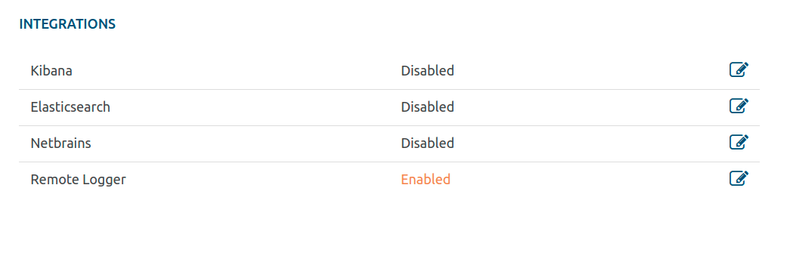
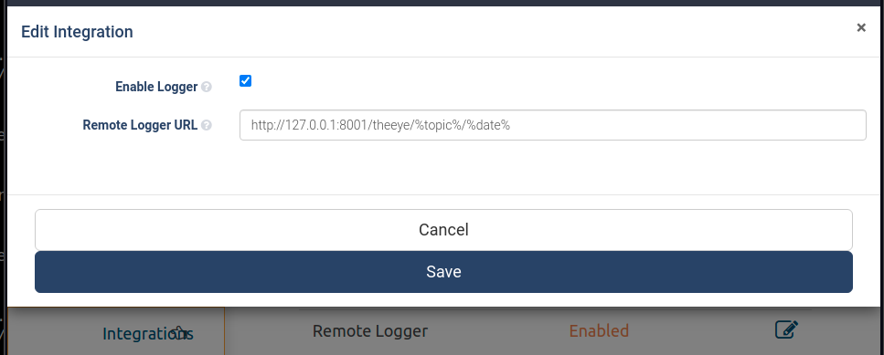
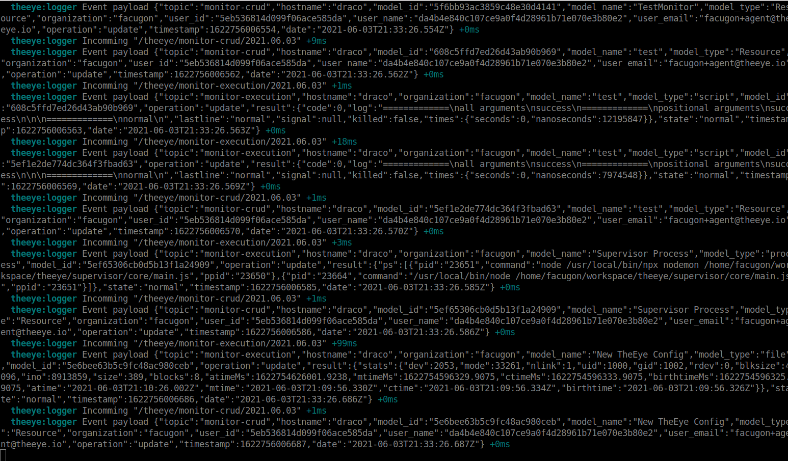
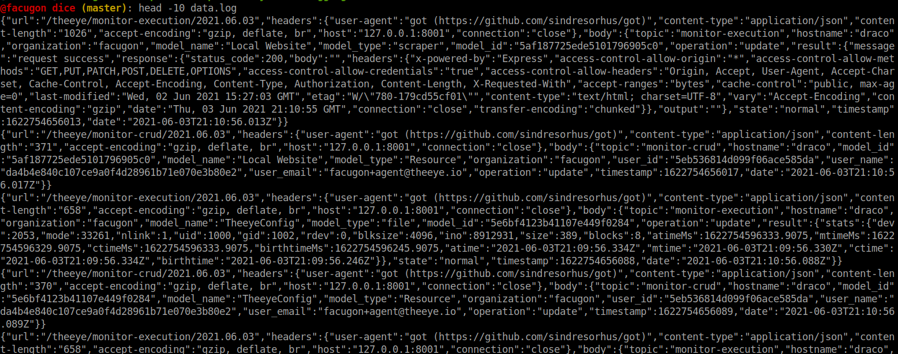
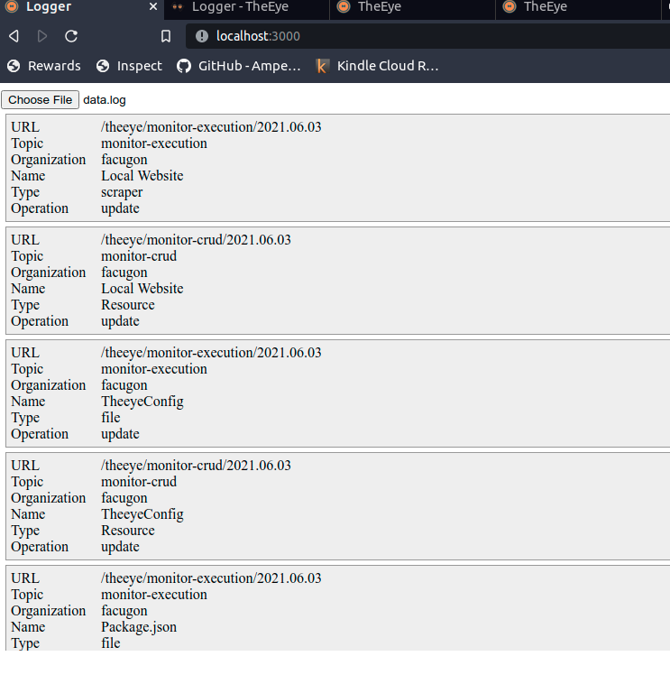
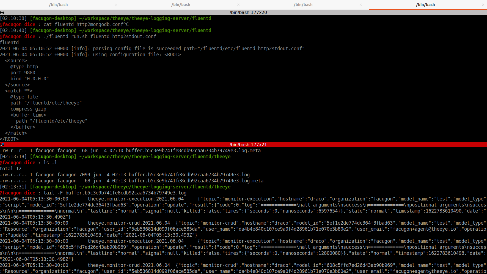

# Theeye Integrations

[](https://theeye.io/en/index.html)

## TheEye Logger Integration

Esta integración permite activar, en cada Organización, el envio de la información generada por los eventos internos de TheEye, hacía una Api externa.

Para activar el envio de eventos hacía una API se debe ingresar al panel de TheEye e ir al menu de Integraciones.





Una vez seleccionada la opción "Integrations" se debe activar el "Remote Logger"






La URL admite dos parámetros opcionales, que pueden ser colocados en cualquier orden y en cualquier parte del a URL, y son reemplazados luego por el valor correspondiente a cada evento.

| Nombre | Descripcion |
| ----- | ------ |
| %topic% | Nombre del evento emitido. [Lista completa de eventos](/core-concepts/events/)|
| %date% | Fecha actual en formato YYYY.MM.DD |

------

## Sample integrations.

### Rest API with NodeJS

[https://github.com/theeye-io/theeye-logger-server-nodejs/tree/master/logger-app](https://github.com/theeye-io/theeye-logger-server-nodejs/tree/master/logger-app)

El codigo de ejemplo se encuentra en este repositorio GitHub.

```
git clone git@github.com:theeye-io/theeye-logger-server-nodejs.git
```

seguir el README para iniciar.

Iniciado el servicio, se debe configurar la integración en el panel de TheEye para comenzaran a recibir los eventos por consola.


Si se inicia este servicio de manera local se puede utilizar alguna herramienta como Ngrok o SSH como reverse proxy, para poder recibir los eventos localmente.


En todos los casos tener en cuenta que existen mejores alternativas para realizar esta labor y esto es solo una herramienta de debug que permite customización.

#### Screenshots.



Los eventos recibidos son almacenados en el archivos data.log. Cada linea es un JSON con la información recibida.



Tambien se incorpora una interfaz reducida y adaptable para visualizar la información de los eventos.



-----

### FluentD

[https://github.com/theeye-io/theeye-logger-server-nodejs/tree/master/fluentd](https://github.com/theeye-io/theeye-logger-server-nodejs/tree/master/fluentd)

Este repositorio contiene un script de inicio de un contenedor docker para recibir los eventos y enviarlos a un archivo de log.


