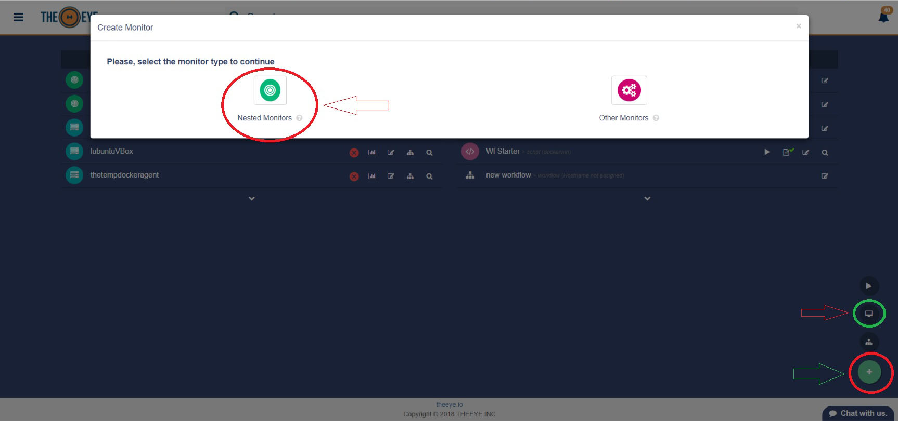
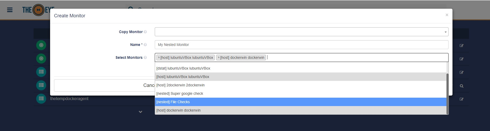

# Monitors

[](https://theeye.io)

## Monitors Documentation

### Contents

* [Stats Monitor](monitors.md#monitor-type-stats)
* [Script Monitor](monitors.md#monitor-type-script)
* [API/Web Check Monitor](monitors.md#monitor-type-api-webcheck)
* [Process Monitor](monitors.md#monitor-type-process)
* [File Monitor](monitors.md#monitor-type-file)
* [Nested Monitor](monitors.md#monitor-type-nested)
* [List monitors/bots via API](monitors.md#list-monitors-via-api)

### Monitor type: Stats

Checks your Hosts' stats \(health\) and triggers alerts when thresholds are exceeded. You can set your own thresholds from the monitors panel.


### Monitor type: Script

Create a script and use the output log to monitor a state when other monitor does not suit your needs. This is an example script to check if a bridge is running.


### Monitor type: API/WEB check

Sends a request to and endpoint and checks for an expected answer. Custom payload and custom expected responses are allowed.


### Monitor type: Process

Verifies that a process is running \(e.g. daemon\)


### Monitor type: File

A File monitor will upload a file to a server and ensure that the file remains as created in the destination path you provided. Most common use is to push a configuration file. The file can be updated at any time directly from the monitor box.

### Monitor type: Nested

A nested monitor is a special monitor that contains other monitors. This kind of monitor will notify when all the contained monitors needs attention. You can create a nested monitor from the dashboard, using the "+" button.



Name your "nested Monitor" or copy an already created one. Add or remove the monitor you'd like to nest.



### List monitors via API

Variables:
**customer**: organization name

**access token**: menu => settings => credentials => Integration Tokens

`curl -sS https://supervisor.theeye.io/${customer}/monitor?access_token=${access_token}`

**Search monitor by name**

```
monName="demo"
curl -sS https://supervisor.theeye.io/${customer}/monitor?access_token=${access_token} | \
  jq -r --arg name "$monName" '.[] | select(.name==$name) | {"name": .name, "id": .id, "state": .resource.state}' | jq -s '.'
```

**Show bot stats**

```
botName="demo"
curl -sS https://supervisor.theeye.io/${customer}/monitor?access_token=${access_token} | \
  jq -r --arg name "$botName" '.[] | select((.name==$name) and (.type=="dstat")) | {"name": .name, "id": .id, "stats": .resource.last_event.data}' | jq -s '.'
```

**Response:**

```
[
  {
    "name": "demo",
    "id": "5bb755f42f78660012bdd9af",
    "stats": {
      "cpu": 3,
      "mem": 36.73548113271163,
      "cache": 4.689083037753453,
      "disk": [
        {
          "name": "xvda2",
          "value": 84.84461326890819
        }
      ]
    }
  }
]
```
