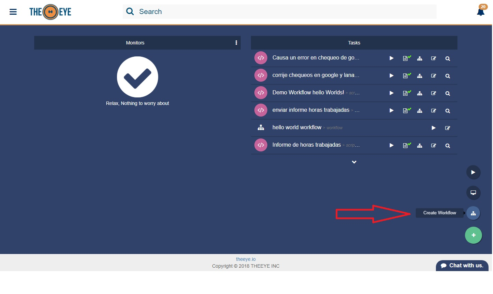
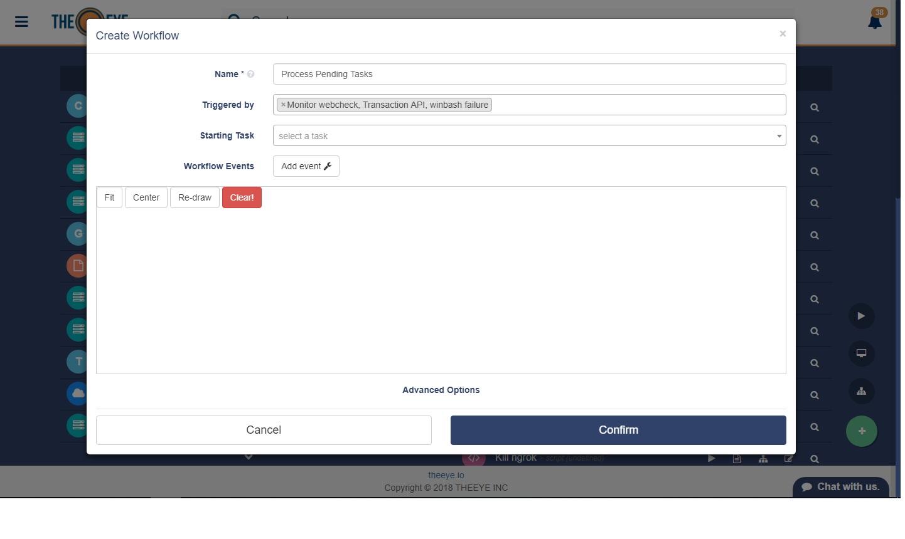
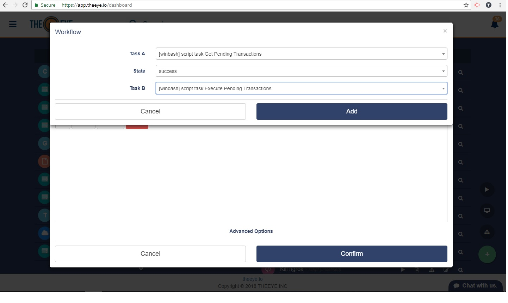
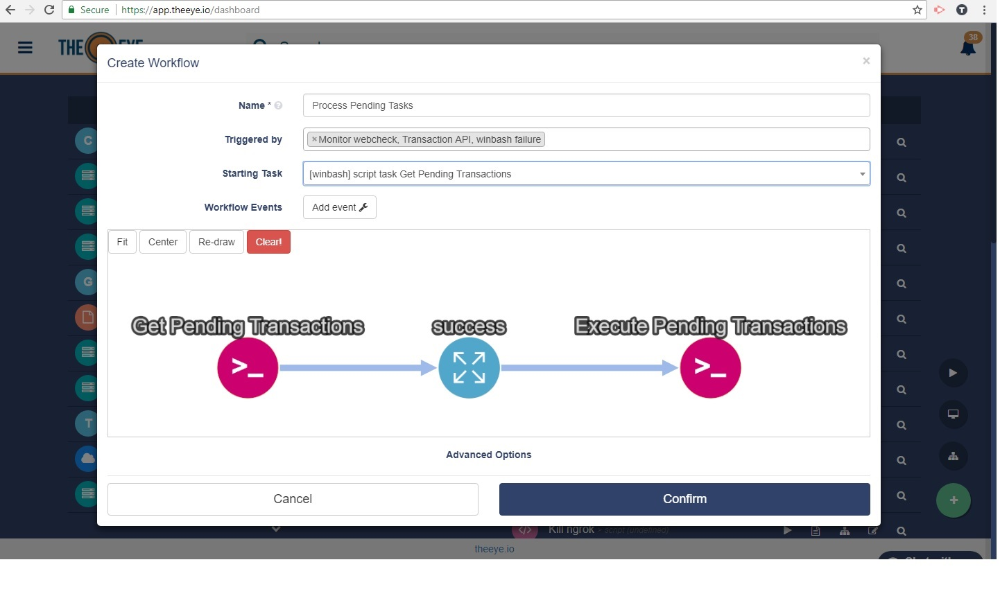
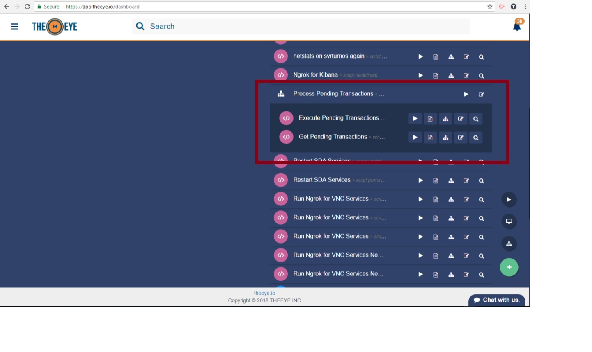

# Workflows

Workflow connects your tasks together to automate complex or dependent processes.

## Workflow Creation

Create a new workflow from the dashboard by clicking the "+" button:

Name your workflow and select a trigger \(Task or monitor\). In this example the trigger is a scrapper monitor that will report failure when the "transaction API" is down.

Add an event to connect tasks, by clicking "Add Event". The examples shows how the success event of task "Get Pending Transactions" will execute the task "Execute Pending Transactions" by passing all the pending transactions to it.

Workflow graph is drawn. Select your starting task and confirm to save the workflow.

Once the workflow is confirmed you'll see it in the dashboard as shown hereunder.

