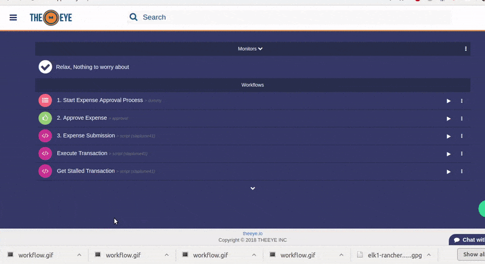

# Workflows

Workflows connects your tasks together to automate complex or dependent processes. Workflow are visibile in the Dashboard and are identified with the icon 

## Workflow Execution

Workflows are launched in the same way tasks are. Each time a workflow is launched a new job is created. The selected starting task, will be executed when a workflow is triggered. In this example the Workflow "Expense Management" is started:

## Workflow Creation

As workflows conects tasks, tasks must be designed and created in advance in order to use them in workflows. Arguments are passed through tasks on each workflow job \(execution\)_._

In this video 3 tasks are conected to create "Expense Management" workflow:  

1. Start Expense Approval Process  \(Input task\)
   * Receives a _text_, a _file_ and a _date._
2. Approve Expense \(Approval task\)
   * Expects a _text,_ a _file_ and a _date._
   * Sends a _text,_ a _file_ and a _date_.
3. Expense submission \(Script task\)
   * Receives a _text_ a _file_ and a _date._

**Step by Step Creation**

Create a new workflow from the dashboard by clicking the "+" button:

Name your workflow and select a trigger \(Task or monitor\). In this example the trigger is a scrapper monitor that will report failure when the "transaction API" is down.

Add an event to connect tasks, by clicking "Add Event". The examples shows how the success event of task "Get Pending Transactions" will execute the task "Execute Pending Transactions" by passing all the pending transactions to it.

Workflow graph is drawn. Select your starting task and confirm to save the workflow.

Once the workflow is confirmed you'll see it in the dashboard as shown hereunder.

